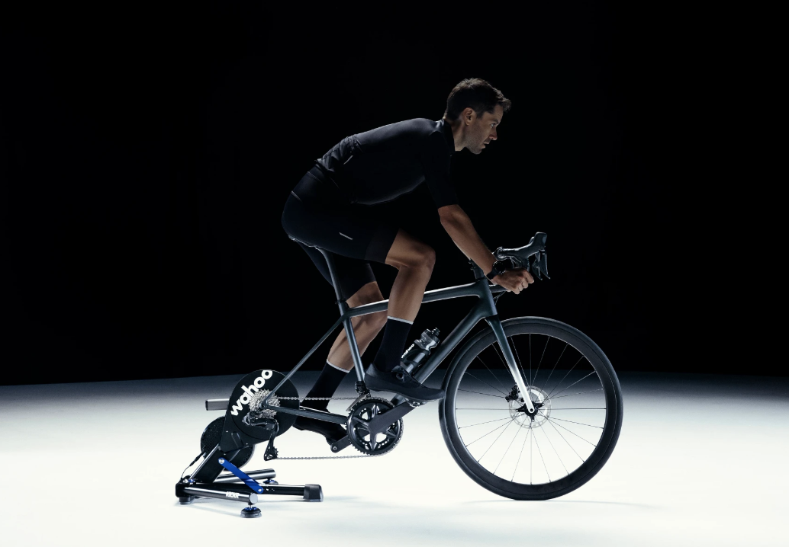
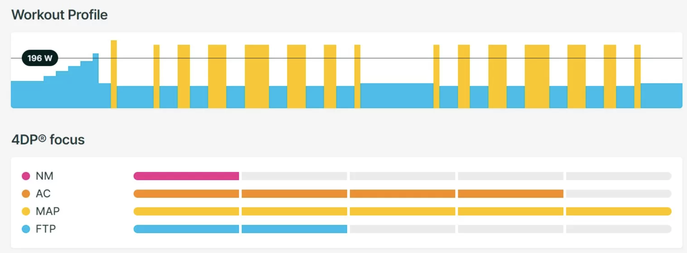
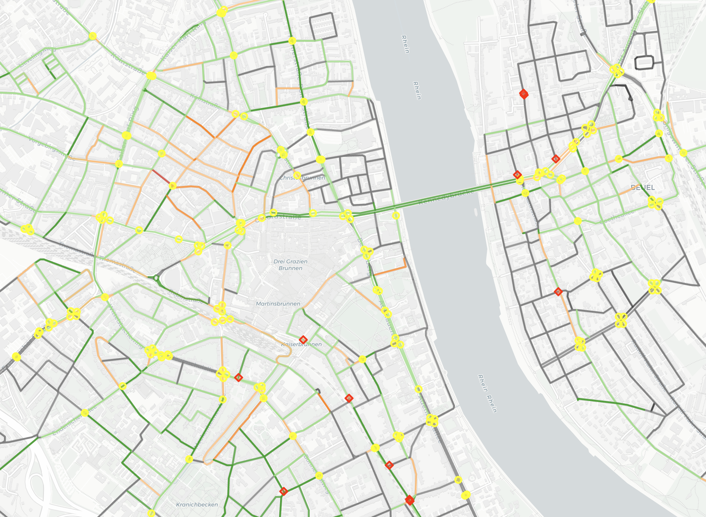

# cammpweek2025

## Description

At Wahoo Fitness, we want to help build the better athlete in all of us.
To do that, we take a multi step approach, developing both hardware solutions to help athletes train,
as well as software solutions and training material to guide them.
We want you to help us, bringing some of the indoor content to the outside world.

Using our indoor trainers, we give athletes the ability to perform specific training programs under optimal circumstances. For example, athletes can use the Wahoo KICKR to perform a specific workout as shown below.

Here, a workout is a sequence of blocks that prescribe how hard the athlete should pedal (what power to push) for how long. An example workout is shown below.

Executing this workout is very easy indoors, but doing it outdoors is more challenging.
You want to avoid stopping at a red light or stop sign during your hard interval segments and prefer
roads with better smoothness over rough, dirty roads.

You are therefore tasked with developing an algorithm that takes as input a workout and information about
the roads in specific town and outputs an _ideal_ mapping of that workout onto the road network.

As an example, I have exported the road network for the city of Bonn (where I live).

The data contains information about the network connectivity, as well as the smoothness of the roads and the surface.

Using you personal concept of _optimality_ and many (likely ambiguous) modeling assumptions, find a way to map a couple of our workouts onto the roads of the city of Bonn. Here, a good course is a course that uses smooth roads, avoids a lot of stop signs during the intervals (or traffic lights), ideally uses the more residential roads rather than busy main roads. Usually, cyclist also don't want to end their workout too far away from their start location.

It's important to start easy, pick some criteria that is important to _you_ and and a way to find an optimal course for that criteria, then expand.

If you have questions along the way, don't hesitate to reach out! Cheers and good luck!

## Installation

-   Install `uv`: https://github.com/astral-sh/uv
-   `git clone git@github.com:thomascamminady/cammpweek2025.git` Clone repo.
-   `cd cammpweek2025`
-   `make uv` Setup `uv`.
-   `make export` Export the data.
-   `make map` Creates a map inside `outpout/`.
-   `make main` To print some basic information about the graph.

## TODO

-   Add workout files
